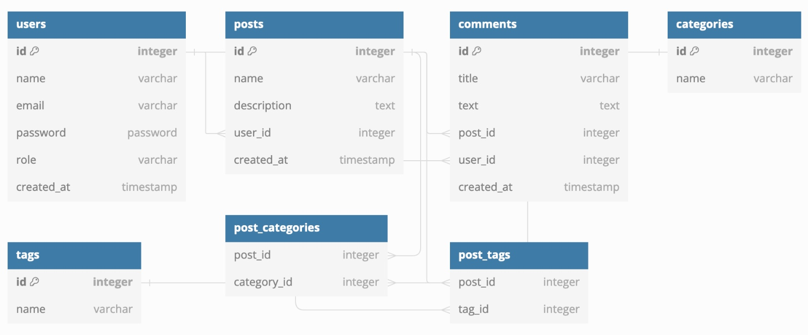

# Blogging API

> Backend API for Blogging application



## Prerequisites

- Node.js 16+

## Install Dependencies

```
npm install
```

## Run App

```
# Run in dev mode
npm run dev

# Run in prod mode
npm start
```

## Postman Docs

Documentation with examples [here](https://documenter.getpostman.com/view/30581720/2sA2xh3DCS)

# Blogging Backend API Specifications

### Posts

- List all posts in the database
  - Pagination
  - Select specific fields in result
  - Limit number of results
  - Filter by fields
- Get single post
- Create new post
- Update posts
- Delete Post

```
categories: {
      enum: ["Web Development", "Mobile Development", "Data Science"],
},
tags: {
      enum: ["JavaScript", "React", "Go", "Python", "Java", "Other"],
}
```

### Comments

- List all comments for a post
- List all comments in general
- Get a single comment
- Create a comment
- Update comment
- Delete comment

### Users & Authentication

- Authentication will be ton using JWT
- User registration
- User login
- Get user
- User CRUD

# Challenge

## Total score

```javascript
function calculateScore(arr) {
  return arr.reduce((totalScore, num) => {
    if (num === 5) {
      return totalScore + 5;
    } else {
      return totalScore + (num % 2 === 0 ? 1 : 3);
    }
  }, 0);
}

// Examples
const example1 = calculateScore([1, 2, 3, 4, 5]); // Output: 13
const example2 = calculateScore([17, 19, 21]); // Output: 9
const example3 = calculateScore([5, 5, 5]); // Output: 15

// Result
console.log(example1);
console.log(example2);
console.log(example3);

// Test Cases
console.log("Test Case 1:", example1 === 13 ? "Passed" : "Failed");
console.log("Test Case 2:", example2 === 9 ? "Passed" : "Failed");
console.log("Test Case 3:", example3 === 15 ? "Passed" : "Failed");
```

## Questions

1. A. - GET
2. B. - /contacts/{contact_id}
3. D. - 401 if the user doesn't exist or if the password is wrong.
4. A. - TRUE
5. B. - Check for the presence of an error. If it exists, throw an exception with the error.
6. C. - Make a driver-based error provider to handle errors in all classes that can issue errors.
7. C. - parseDataForProducts()
8. D. - Put them in a .env file, load data from it into a configuration system, then request the credentials from a database service provider.

## Scenario Analysis

Lo primero sería implementar un mecanismo de monitoreo y registro en todo el sistema para realizar un seguimiento de las métricas de rendimiento, latencia y tasas de error.

Segundo, realizaría un enfoque integral que cubra la identificación, solución y estrategias para la alta disponibilidad y resiliencia.

Posibles soluciones:

1. Balanceo de carga para distribuir el tráfico de manera uniforme entre los microservicios.
2. Redundancia en microservicios críticos para asegurar que, si una instancia falla, otras puedan tomar el control de manera transparente, implementando replicación de servicios.
3. Tolerancia a fallos evitando interrupciones en todo el sistema.
4. Utilizar bases de datos distribuidas con replicación incorporada.
5. Utilizar herramientas de orquestación de contenedores para realizar despliegues graduales.
6. Utilizar CDN para reducir latencias.
7. Actualizar la arquitectura del sistema en función de las métricas de rendimiento.
